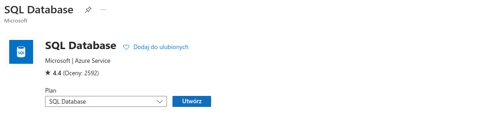

# Laboratorium 1
## Krok 1: Utworzenie konta AZURE

## Krok 2: Utworzenie instancji Azure SQL Database
#### a. Tworzenie zasobu

#### b. Konfiguracja projketu

###### Tworzenie serwera

###### Konfiguracja bazy danych

###### Sieć

#### Zabezpieczenia
- microsoft defender sql
- rejestr

[text](https://learn.microsoft.com/pl-pl/azure/storage/blobs/immutable-policy-configure-version-scope?tabs=azure-portal&WT.mc_id=Portal-SqlAzureExtension)

#### Encrypted enclaves

[text](https://learn.microsoft.com/pl-pl/sql/relational-databases/security/encryption/always-encrypted-enclaves?view=sql-server-ver16)

#### Dane

#### Tagi

#### Podsumowanie

[text](https://learn.microsoft.com/pl-pl/legal/marketplace/marketplace-terms)

