# Laboratorium 1
[TOC]
## Krok 1: Utworzenie konta AZURE


## Krok 2: Utworzenie instancji Azure SQL Database
#### a. Tworzenie zasobu


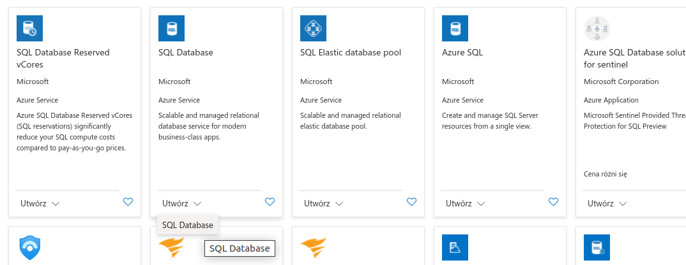


#### b. Konfiguracja projketu
- tworzenie **grupy zasobów**
  kontenera grupującego zasoby odpowiadające jednemu środowisku
  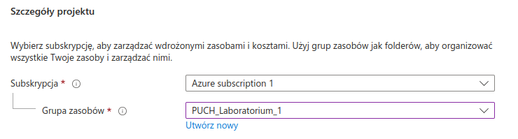
- nazwanie bazy danych
  

#### c. Konfiguracja serwera
- utworzenie serwera
  
- określenie metody uwierzytelniania
  SQL, Microsoft Entra lub obie możliwości
  

#### e. Wybór opcji cenowych i rozmiaru
- Konfiguracja bazy danych
  
  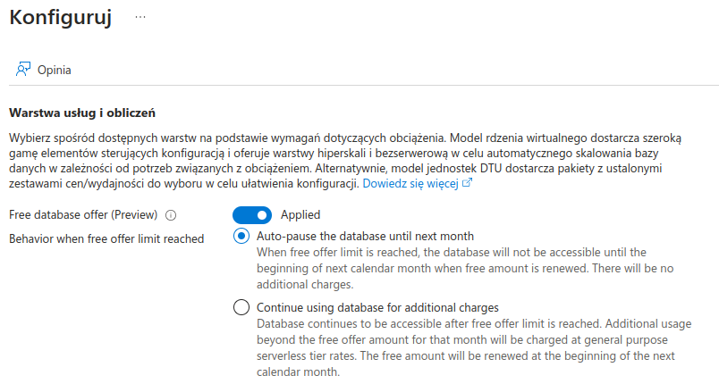
  Opcje liczby rdzeni i maksymalnej pamięci zostały pozostawione jako defaultowe
  

  <!-- 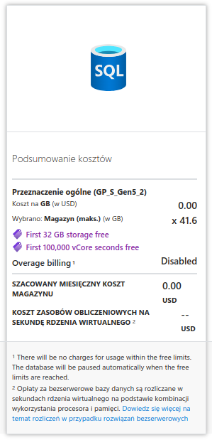 -->

#### f. Dodatkowe ustawienia
###### Ustawienia sieci
- Łączność sieciowa została ustwiona na: Publiczny punkt końcowy
  
- Reguły zapory sieciowej skonfigurowano tak, aby możliwy był dostęp z aktualnego IP
  
- Zasady połączenia pozostały domyślne
  
- Połączenia szyfrowane pozostały na domyślnej minimalnej wersji protokołu TLS 1.2
  
###### Zabezpieczenia
 
- Rejestr kryptograficzny
  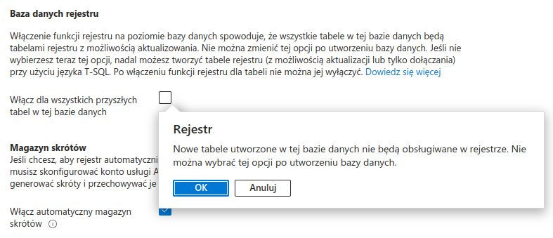
  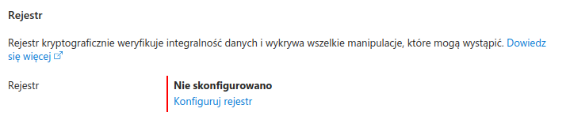
- Magazyn skrótów
  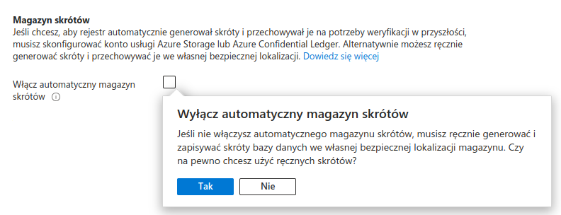

  

- Tożsamości serwera
  Ustawienie tożsamości zarządzanai przypisanej przez system mogłoby ułatwić dostęp aplikacji do innych zasobów Azure (ożsamość zarządzana przypisana przez system pozwoli Ci na bezpieczne uwierzytelnianie bez konieczności przechowywania poświadczeń w kodzie)
  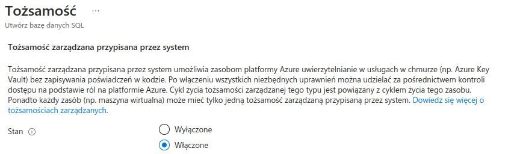

  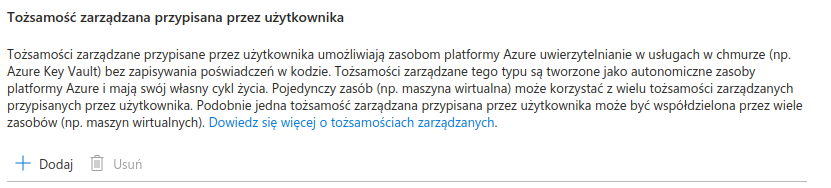

  

- Always Encrypted
  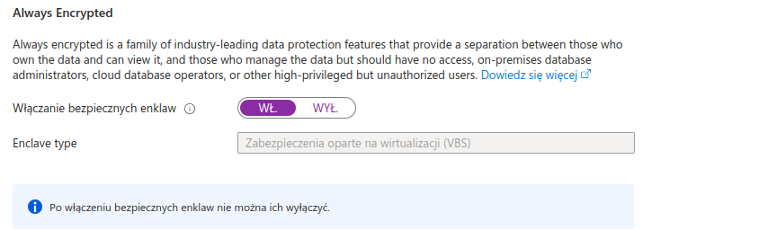

- Źródło danych
  

- Tagi
  

###### Podsumowanie


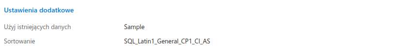

## Krok 3: Zatwierdzenie i wdrożenie


```
{
    "status": "Failed",
    "error": {
        "code": "RedundancyConfigurationNotAvailableInRegion",
        "message": "The storage account failed to create due to redundancy configuration - Sku: Standard_RAGRS, Kind: StorageV2 - not available in selected Region - polandcentral. Please make sure the redundancy configuration selected is available in your region. For more information about redundancy configurations, see https://docs.microsoft.com/en-us/azure/storage/common/storage-redundancy"
    }
}
```

## Krok 4: Połączenie z bazą danych
1. Połączenie przez SSMS


2. Połączenie przez Azure Data Studio


