# Laboratorium 1
[TOC]
## Krok 1: Utworzenie konta AZURE
- Uruchomienie wersji próbnej platformy Azure


## Krok 2: Utworzenie instancji Azure SQL Database
#### a. Tworzenie zasobu


- Wyszukanie SQL Database
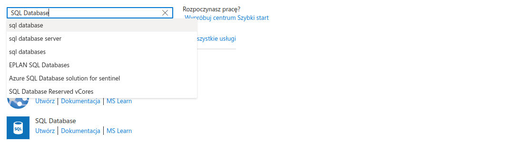


#### b. Konfiguracja projketu
- tworzenie grupy zasobów
  kontenera grupującego zasoby odpowiadające jednemu środowisku

  

- nazwanie bazy danych

  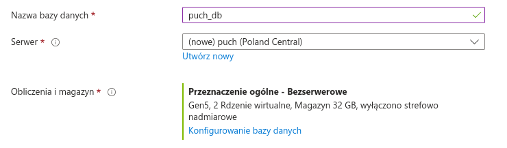

#### c. Konfiguracja serwera

- utworzenie serwera 

  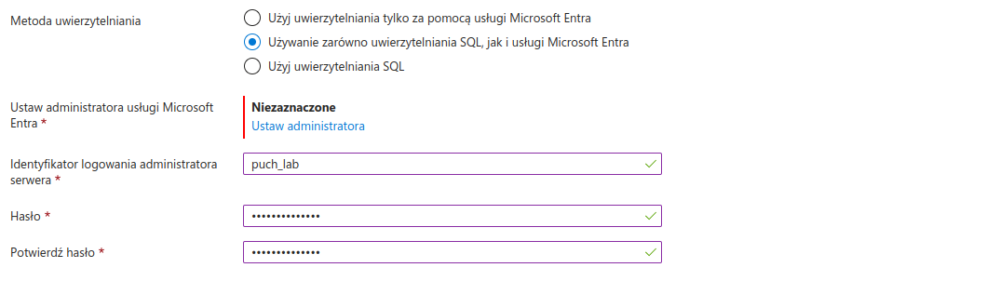

- określenie metody uwierzytelniania
  SQL, Microsoft Entra lub obie możliwości
  
  

#### e. Wybór opcji cenowych i rozmiaru
- Konfiguracja bazy danych

  
  

  Opcje liczby rdzeni i maksymalnej pamięci zostały pozostawione jako defaultowe
  

  <!--  -->

#### f. Dodatkowe ustawienia
###### Ustawienia sieci
- Łączność sieciowa została ustwiona na: Publiczny punkt końcowy

  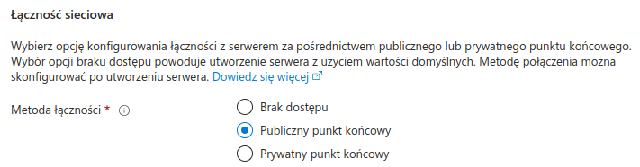

- Reguły zapory sieciowej skonfigurowano tak, aby możliwy był dostęp z aktualnego IP

  

- Zasady połączenia pozostały domyślne

  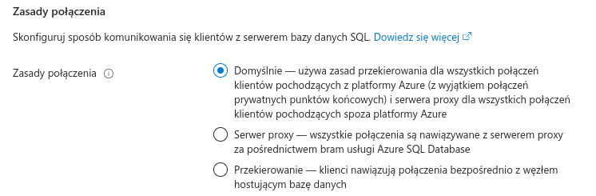

- Połączenia szyfrowane pozostały na domyślnej minimalnej wersji protokołu TLS 1.2

  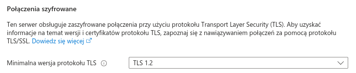
###### Zabezpieczenia

 

- Rejestr kryptograficzny

  

  

- Magazyn skrótów
  

  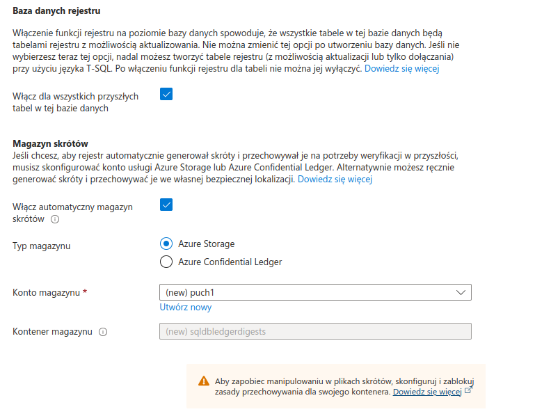

- Tożsamości serwera
  Ustawienie tożsamości zarządzanai przypisanej przez system mogłoby ułatwić dostęp aplikacji do innych zasobów Azure (tożsamość zarządzana przypisana przez system pozwoli Ci na bezpieczne uwierzytelnianie bez konieczności przechowywania poświadczeń w kodzie)
  

  

  

- Always Encrypted
  

- Źródło danych
  

- Tagi
  

###### Podsumowanie


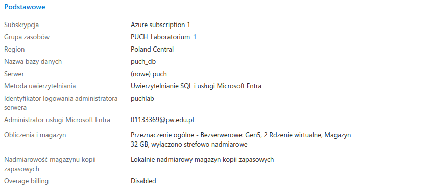
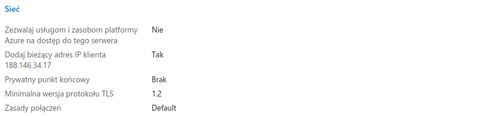
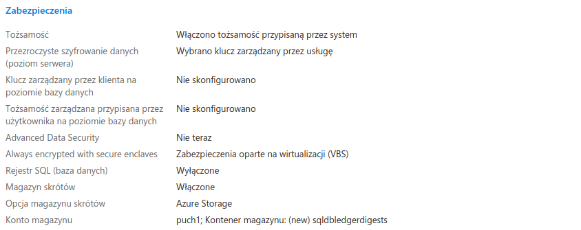


## Krok 3: Zatwierdzenie i wdrożenie

## Krok 4: Połączenie z bazą danych
1. Połączenie przez SSMS


2. Połączenie przez Azure Data Studio


## Krok 5: Tworzenie aplikacji
1. Instalacja .NET SDK
2. Utworzenie szkieletu aplikacji
```
dotnet new console -n SimpleApp
```
3. Dodanie EntityFrameworkCore i SqlSever
```
dotnet add package Microsoft.EntityFrameworkCore --version 8.0.0
dotnet add package Microsoft.EntityFrameworkCore.SqlServer --version 8.0.0
```
4. Połączenie z bazą danych
- Odnalezienie paramatrów połączenia


```
Server=tcp:puch.database.windows.net,1433;Initial Catalog=puch_db;Persist Security Info=False;User ID=puchlab;Password={your_password};MultipleActiveResultSets=False;Encrypt=True;TrustServerCertificate=False;Connection Timeout=30;s
``` 
5. Stworzenie małej tabeli MyTable
```
CREATE TABLE [SalesLT].[MyTable] (
    [ProductID] [int] IDENTITY(1,1) NOT NULL,
	[Color] [nvarchar](15) NULL,
	[StandardCost] [money] NOT NULL,
    [ModifiedDate] [datetime] NOT NULL,
    CONSTRAINT [PK_MyTable_ProductID] PRIMARY KEY CLUSTERED 
    (
        [ProductID] ASC
    )
);
INSERT INTO [SalesLT].[MyTable] ([Color], [StandardCost], [ModifiedDate])
SELECT [Color], [StandardCost], [ModifiedDate]
FROM [SalesLT].[Product];
```
6. Stworzenie klasy odzwierciedlającej atrybuty tabeli
```
namespace SimpleApp.Models
{
    public class Product
    {
        public int ProductID { get; set; }
        public string? Color { get; set; }
        public decimal StandardCost { get; set; }
        public DateTime ModifiedDate { get; set; }
    }
}
```
7. Stworzenie kontekstu połączenia z bazą danych
```
using Microsoft.EntityFrameworkCore;
using SimpleApp.Models;

namespace SimpleApp.Models
{
    public class AppDbContext : DbContext
    {
        public AppDbContext(DbContextOptions<AppDbContext> options) : base(options) { }

        public DbSet<Product> Products { get; set; }

        protected override void OnModelCreating(ModelBuilder modelBuilder)
        {
            modelBuilder.Entity<Product>().ToTable("MyTable", "SalesLT");
        }
    }
}
```
8. Utworzenie programu, który drukuje zawartość tabeli do konsoli
Wymaga utworzenia obiektu kontekstu połączenia AppDbContext
```
var optionsBuilder = new DbContextOptionsBuilder<AppDbContext>();
optionsBuilder.UseSqlServer("<parametry połączenia>");
```
oraz wykorzystania go do pobrania danych z tabeli do zmiennej. 
```
using (var context = new AppDbContext(optionsBuilder.Options))
{
  var products = await context.Products.ToListAsync();

  Console.WriteLine("Products:");
  Console.WriteLine("ID\tColor\tStandard Cost\tModified Date");
  foreach (var product in products)
  {
      Console.WriteLine($"{product.ProductID}\t{product.Color}\t{product.StandardCost:C}\t{product.ModifiedDate:yyyy-MM-dd}");
  }
}
```

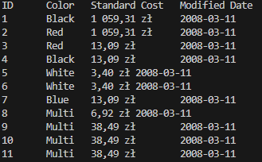

## Krok 6: Konfiguracja maszyny wirtualnej
1. Utworzenie maszyny wirtualnej

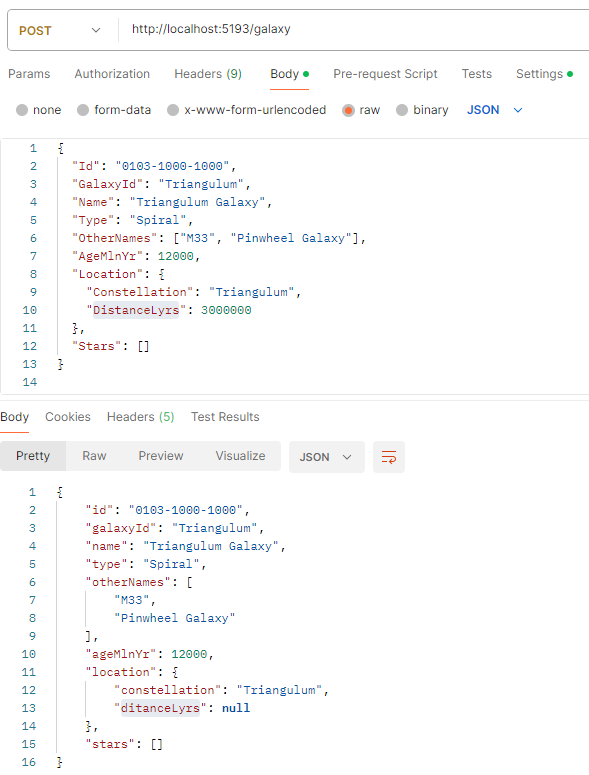

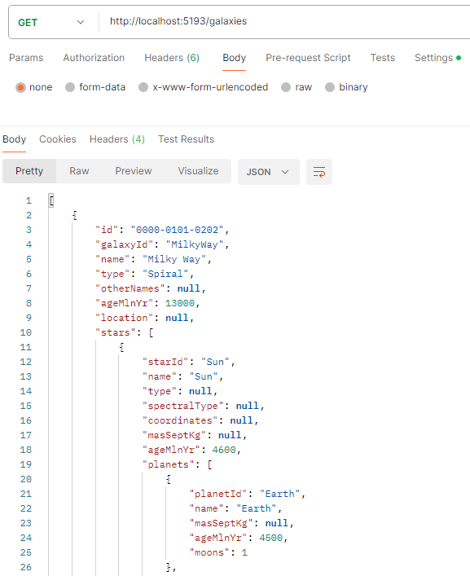

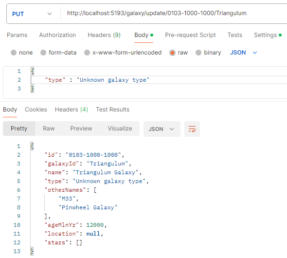

Zezwolenie na ruch sieciowy do portów rdp i http
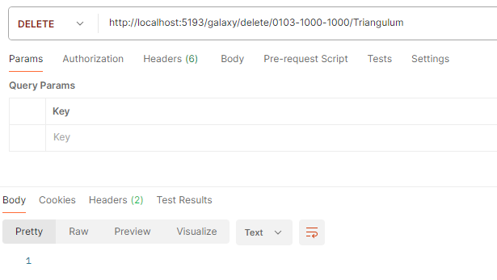

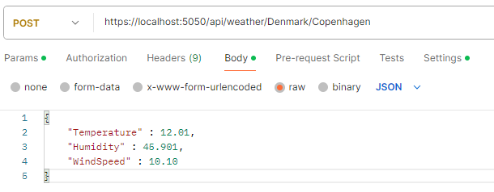

3. Instalacja SQL Servera
4. Dostosowanie ustawień WindowsDefender


