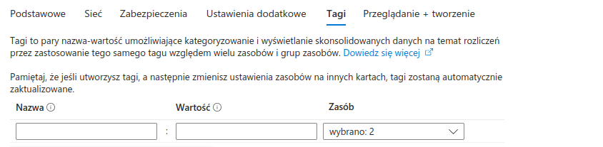
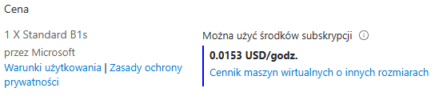
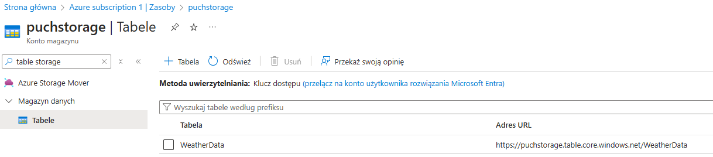
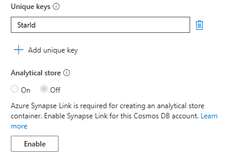

# Laboratorium 1

## Krok 1: Utworzenie konta AZURE
- Uruchomienie wersji próbnej platformy Azure


## Krok 2: Utworzenie instancji Azure SQL Database
#### a. Tworzenie zasobu


- Wyszukanie SQL Database


#### b. Konfiguracja projketu
- tworzenie grupy zasobów
  kontenera grupującego zasoby odpowiadające jednemu środowisku

  

- nazwanie bazy danych

  

#### c. Konfiguracja serwera

- utworzenie serwera 

  

- określenie metody uwierzytelniania
  SQL, Microsoft Entra lub obie możliwości

  

#### e. Wybór opcji cenowych i rozmiaru
- Konfiguracja bazy danych

  
  

  Opcje liczby rdzeni i maksymalnej pamięci zostały pozostawione jako defaultowe
  

  <!--  -->

#### f. Dodatkowe ustawienia
###### Ustawienia sieci
- Łączność sieciowa została ustwiona na: Publiczny punkt końcowy

  

- Reguły zapory sieciowej skonfigurowano tak, aby możliwy był dostęp z aktualnego IP

  

- Zasady połączenia pozostały domyślne

  

- Połączenia szyfrowane pozostały na domyślnej minimalnej wersji protokołu TLS 1.2

  
###### Zabezpieczenia

 

- Rejestr kryptograficzny

  

  

- Magazyn skrótów
  

  

- Tożsamości serwera
  Ustawienie tożsamości zarządzanai przypisanej przez system mogłoby ułatwić dostęp aplikacji do innych zasobów Azure (tożsamość zarządzana przypisana przez system pozwoli Ci na bezpieczne uwierzytelnianie bez konieczności przechowywania poświadczeń w kodzie)
  

  

  

- Always Encrypted
  

- Źródło danych
  

- Tagi
  

###### Podsumowanie


## Krok 3: Zatwierdzenie i wdrożenie

## Krok 4: Połączenie z bazą danych
1. Połączenie przez SSMS


2. Połączenie przez Azure Data Studio


## Krok 5: Tworzenie aplikacji
1. Instalacja .NET SDK
2. Utworzenie szkieletu aplikacji
```
dotnet new console -n SimpleApp
```
3. Dodanie EntityFrameworkCore i SqlSever
```
dotnet add package Microsoft.EntityFrameworkCore --version 8.0.0
dotnet add package Microsoft.EntityFrameworkCore.SqlServer --version 8.0.0
```
4. Połączenie z bazą danych
- Odnalezienie paramatrów połączenia


```
Server=tcp:puch.database.windows.net,1433;Initial Catalog=puch_db;Persist Security Info=False;User ID=puchlab;Password={password};MultipleActiveResultSets=False;Encrypt=True;TrustServerCertificate=False;Connection Timeout=30;s
``` 
5. Stworzenie małej tabeli MyTable
```
CREATE TABLE [SalesLT].[MyTable] (
    [ProductID] [int] IDENTITY(1,1) NOT NULL,
	[Color] [nvarchar](15) NULL,
	[StandardCost] [money] NOT NULL,
    [ModifiedDate] [datetime] NOT NULL,
    CONSTRAINT [PK_MyTable_ProductID] PRIMARY KEY CLUSTERED 
    (
        [ProductID] ASC
    )
);
INSERT INTO [SalesLT].[MyTable] ([Color], [StandardCost], [ModifiedDate])
SELECT [Color], [StandardCost], [ModifiedDate]
FROM [SalesLT].[Product];
```
6. Stworzenie klasy odzwierciedlającej atrybuty tabeli
```
namespace SimpleApp.Models
{
    public class Product
    {
        public int ProductID { get; set; }
        public string? Color { get; set; }
        public decimal StandardCost { get; set; }
        public DateTime ModifiedDate { get; set; }
    }
}
```
7. Stworzenie kontekstu połączenia z bazą danych
```
using Microsoft.EntityFrameworkCore;
using SimpleApp.Models;

namespace SimpleApp.Models
{
    public class AppDbContext : DbContext
    {
        public AppDbContext(DbContextOptions<AppDbContext> options) : base(options) { }

        public DbSet<Product> Products { get; set; }

        protected override void OnModelCreating(ModelBuilder modelBuilder)
        {
            modelBuilder.Entity<Product>().ToTable("MyTable", "SalesLT");
        }
    }
}
```
8. Utworzenie programu, który drukuje zawartość tabeli do konsoli
Wymaga utworzenia obiektu kontekstu połączenia AppDbContext
```
var optionsBuilder = new DbContextOptionsBuilder<AppDbContext>();
optionsBuilder.UseSqlServer("<parametry połączenia>");
```
oraz wykorzystania go do pobrania danych z tabeli do zmiennej. 
```
using (var context = new AppDbContext(optionsBuilder.Options))
{
  var products = await context.Products.ToListAsync();

  Console.WriteLine("Products:");
  Console.WriteLine("ID\tColor\tStandard Cost\tModified Date");
  foreach (var product in products)
  {
      Console.WriteLine($"{product.ProductID}\t{product.Color}\t{product.StandardCost:C}\t{product.ModifiedDate:yyyy-MM-dd}");
  }
}
```


## Krok 6: Konfiguracja maszyny wirtualnej
1. Utworzenie maszyny wirtualnej


Zezwolenie na ruch sieciowy do portów rdp i http




<div style="padding: 10px; border: 1px solid #f5c6cb; background-color: #f8d7da; color: #721c24;">
  <strong>Nastąpił problem z łączeniem się do maszyny wirtualnej</strong> </br>
  Ze względu na to, że powtarzał się problem z połączeniem się przez rdp z maszyną wirtualną została ona usunięta. Podjęta została kolejna próba utworzenia maszyny wirtualnej.
</div>


3. Utworzenenie maszyny wirtualnej z SQL Server 

- Wybór opcji wdrożenia 'Maszyny wirtualne SQL'


- Ustawienie odpowiedniego regionu oraz strefy dostępności


- Pozostawienie obrazu Free SQL Server Licnese


- Wybór najmniejszej dostępnej ilości pamięci


- Uzupełnienie danych konta administratora


- Ustawienie możliwości połączenia się z maszyną przez rdp i http


- Wybór typu dysku twardego maszyny wirtualnej


- Publiczny adres IP został pozostawiony pusty


- Włączono możliwość uwierzytelnienia SQL


- Podsumowanie kosztów


- Posumowanie parametrów maszyny wirtualnej


- Niepowodzenie przy wdrażaniu


- Szczegóły błędu


- Sprawdzenie statusu SQL Servera po połączeniu się z maszyną wirtualną przez rdp


- Próba włączenia SQL Servera


- Błąd przy próbie włączenia SQL Servera


<div style="padding: 10px; border: 1px solid #f5c6cb; background-color: #f8d7da; color: #721c24;">
  <strong>Błąd przy wdrożeniu SQL Servera</strong> </br>
  Ze względu na problem przy wdrożeniu SQL Server na maszynie wirtualnej proces tworzenia został wykonany ponownie z wykorzystaniem tutorialu.
</div>

[video](https://www.youtube.com/watch?v=iHdQmnCcaOg)

4. Utworzenie maszyny wirtualnej 

- Utworzenie maszyny tym razem ponownie przez wybór zasobu 'Maszyna wirtualna'


- Wybór grupy zasobów


- Wybór nazwy maszyny oraz regionu 


- Strefa dostępności pozostała na opcji 'Strefa 1'
- Jako obraz maszyny pozostawiono wybór 'SQL Server 2019 Developer'


- Pozostawiono domyślny rozmiar dysku


- Uzupełniono login i hasło administratora
- Pozostawiono możliwość połączenia się z vm przez port rdp
- Zmieniono ustawienia dysku na wartość 'SSD Standard'


- Zabroniono połączeń przychodzących zzewnątrz 


- Ustawiono opcję 'Usuwanie publicznego adresu IP i karty sieciowej po usunięciu maszyny wirtualnej'

- Opcje równoważenia obciązenia pozostały domyślne ('Brak')

- Ustawiono opcje automatycznego zamykania


- Ustawona została opcja 'Łączność SQL' -> 'Publiczne (Internet)


- Włączone zostało uwierzytelnianie SQL


- Skonfigurowano magazyn wybierając 'Zmień konfigurację'


- Zmieniono typ dysku na mniejszy (16 GiB)


- Zmniejszono wielkość dysku magazynu dziennika do 16 GiB


- Wystąpił błąd związany z lokalizacją wybranego regionu


- Wyłączono opcję automatycznego zamykania, aby uzyskać pomyślną konfigurację


- Podsumowanie kosztów


- Uzyskano błąd wdrożenia


## Krok 7: Storage Account
1. Utworzenie konta magazynu (Storage Account)
- Wyszukanie w portalu 'storage account'
- Wybranie 'Konta magazynu'
- Wybranie przycisku 'Utwórz'


2. Konfiguracja konta
[CLI](https://learn.microsoft.com/en-us/azure/storage/common/storage-account-create?tabs=azure-cli)
- Dodanie konta do grupy zasobów
- Nazwanie konta magazynu
- Wybór regionu: (Europe) Poland Central
- Wybranie parametrów usługi
  - sku (Stock Keeping Unit)
  ```
  az storage account create: 'LRS' is not a valid value for '--sku'. Allowed values: Standard_LRS, Standard_GRS, Standard_RAGRS, Standard_ZRS, Premium_LRS, Premium_ZRS, Standard_GZRS, Standard_RAGZRS 
  ```
  _LRS_ - Locally Redundant Storage
    - Replikuje dane synchronicznie trzy razy w tym samym centrum danych w regionie podstawowym.
    - Zapewnia najmniejszy koszt i najniższą trwałość w porównaniu do innych opcji.
    - Chroni dane przed awariami serwerów i dysków, ale nie przed katastrofami, które dotykają całe centrum danych (np. pożar, powódź)

  _ZRS_ - Zone-Redundant Storage
   - Replikuje dane synchronicznie w trzech strefach dostępności Azure w regionie podstawowym
   - Każda strefa dostępności to oddzielna lokalizacja fizyczna z niezależnym zasilaniem, chłodzeniem i siecią
   - Zapewnia wyższą trwałość niż LRS, ponieważ dane są chronione przed awarią pojedynczej strefy dostępności

  _GRS_ - Geo-Redundant Storage
   - Replikuje dane synchronicznie trzy razy w regionie podstawowym (używając LRS)
   - Następnie asynchronicznie kopiuje dane do regionu pomocniczego, oddalonego o setki kilometrów
   - W regionie pomocniczym dane są również replikowane synchronicznie trzy razy (używając LRS)
   - Zapewnia najwyższy poziom trwałości
      RA-GRS (Read-Access Geo-Redundant Storage)
      RA-GZRS (Read-Access Geo-Zone-Redundant Storage)


```
{
  "accessTier": "Hot",
  "accountMigrationInProgress": null,
  "allowBlobPublicAccess": false,
  "allowCrossTenantReplication": false,
  "allowSharedKeyAccess": null,
  "allowedCopyScope": null,
  "azureFilesIdentityBasedAuthentication": null,
  "blobRestoreStatus": null,
  "creationTime": "2024-11-01T01:36:51.250595+00:00",
  "customDomain": null,
  "defaultToOAuthAuthentication": null,
  "dnsEndpointType": null,
  "enableExtendedGroups": null,
  "enableHttpsTrafficOnly": true,
  "enableNfsV3": null,
  "encryption": {
    "encryptionIdentity": null,
    "keySource": "Microsoft.Storage",
    "keyVaultProperties": null,
    "requireInfrastructureEncryption": null,
    "services": {
      "blob": {
        "enabled": true,
        "keyType": "Account",
        "lastEnabledTime": "2024-11-01T01:36:51.578626+00:00"
      },
      "file": {
        "enabled": true,
        "keyType": "Account",
        "lastEnabledTime": "2024-11-01T01:36:51.578626+00:00"
      },
      "queue": null,
      "table": null
    }
  },
  "extendedLocation": null,
  "failoverInProgress": null,
  "geoReplicationStats": null,
  "id": "/subscriptions/a3c39300-5bda-4650-8d3f-a2dcb45581d6/resourceGroups/puch-storage/providers/Microsoft.Storage/storageAccounts/puchstorage",
  "identity": null,
  "immutableStorageWithVersioning": null,
  "isHnsEnabled": null,
  "isLocalUserEnabled": null,
  "isSftpEnabled": null,
  "isSftpEnabled": null,
  "isSkuConversionBlocked": null,
  "keyCreationTime": {
    "key1": "2024-11-01T01:36:51.297374+00:00",
    "key2": "2024-11-01T01:36:51.297374+00:00"
  },
  "keyPolicy": null,
  "kind": "StorageV2",
  "largeFileSharesState": null,
  "lastGeoFailoverTime": null,
  "location": "polandcentral",
  "minimumTlsVersion": "TLS1_2",
  "name": "puchstorage",
  "networkRuleSet": {
    "bypass": "AzureServices",
    "defaultAction": "Allow",
    "ipRules": [],
    "ipv6Rules": [],
    "resourceAccessRules": null,
    "virtualNetworkRules": []
  },
  "primaryEndpoints": {
    "blob": "https://puchstorage.blob.core.windows.net/",
    "dfs": "https://puchstorage.dfs.core.windows.net/",
    "file": "https://puchstorage.file.core.windows.net/",
    "internetEndpoints": null,
    "microsoftEndpoints": null,
    "queue": "https://puchstorage.queue.core.windows.net/",
    "table": "https://puchstorage.table.core.windows.net/",
    "web": "https://puchstorage.z36.web.core.windows.net/"
  },
  "primaryLocation": "polandcentral",
  "privateEndpointConnections": [],
  "provisioningState": "Succeeded",
  "publicNetworkAccess": null,
  "resourceGroup": "puch-storage",
  "routingPreference": null,
  "sasPolicy": null,
  "secondaryEndpoints": null,
  "secondaryLocation": null,
  "sku": {
    "name": "Standard_LRS",
    "tier": "Standard"
  },
  "statusOfPrimary": "available",
  "statusOfSecondary": null,
  "storageAccountSkuConversionStatus": null,
  "tags": {},
  "type": "Microsoft.Storage/storageAccounts"
}
```
3. Tworzenie tabeli 




4. Dodanie rozszerzenia storage-preview


5. Instalacja Storage Explorer

6. Dodanie danych


##### Pobieranie danych z C# lub inna technologia:
1. Stworzenie prostej aplikacji webowej w .NET 


2. Dodanie pakietu obsługującego zapytania do Azure Table Storage


3. Dodanie klasy reprezentującej dane w tabeli WeatherData
```.NET
using Azure;
using Azure.Data.Tables;

public class WeatherData : ITableEntity
{
    public string PartitionKey { get; set; }

    public string RowKey { get; set; }

    public DateTimeOffset? Timestamp { get; set; }

    public ETag ETag { get; set; }

    // ...
}
```
3. Połączenie z kontem Azure Storage

- odnalezienie klucza do konta Azure Storage


- zapisanie klucza Key1


- utworzenie wpisu w pliku ```appsettings.json```

```JSON
  "TableStorage": {
    "ConnectionString": "...",
    "TableName": "WeatherData"
  }
```

4. Obsługa operacji CRUD

- Utworzona została aplikacja webowa w technologii .NET
```
dotnet new webapp -n CrudApp
```
- Należy zaimportować pakiet Azure.Data.Tables
```
dotnet add package Azure.Data.Tables
```
- Kluczowym elementem połączenia jest wskazanie parametrów połączenia w pliku appsettings.json
```
  "AzureTableStorage": {
    "ConnectionString": "DefaultEndpointsProtocol=https;AccountName=puchstorage;AccountKey=<key>;EndpointSuffix=core.windows.net",
    "TableName": "WeatherData"
  },
```
Jest on skopiowany ze strony portal.azure po wybraniu 'Konta magazynu' z listy zasobów Azure. Należy odnaleźć 'Zabezpieczenia i sieć' -> Klucze dostępu.


Następnie skopiować 'Parametry dostępu'


- Aby połączyć się z magazynem danych w kodzie muszą zostać przekazane odpowiednie argumenty z appsettings.json do obiektu TableClient z pakietu Azure.Data.Tables.
```
var builder = WebApplication.CreateBuilder(args);
var configuration = builder.Configuration;

//...

builder.Services.AddSingleton<TableClient>(sp =>
{
    var connectionString = configuration["AzureTableStorage:ConnectionString"];
    var tableName = configuration["AzureTableStorage:TableName"];
    var serviceClient = new TableServiceClient(connectionString);
    var tableClient = serviceClient.GetTableClient(tableName);
    tableClient.CreateIfNotExists();
    return tableClient;
});
```
- Dodany zostaje model utworzonej tabeli. Klasa ta musi implementować interfejs ITableEntity oraz uwzględniać pola PartitionKey i RowKey.
- Po utworzeniu obiektu aplikacji dodawane są endpointy realizujące wymagane operacje
```
var app = builder.Build();
// ...
app.MapPost("api/weather/{partitionKey}/{rowKey}", async (string partitionKey, string rowKey, WeatherInsertData weather, TableClient tableClient) =>
{
    try
    {
        // ... utworzenie nowego obiektu (data) typu WeatherData 
        // na podstawie otrzymanych danych 

        await tableClient.AddEntityAsync(data); // zapisanie rekordu
        return Results.Created($"/api/weather/{data.PartitionKey}/{data.RowKey}", data);
    }
    catch (Exception ex)
    {
        return Results.Problem($"Error occurred while inserting data: {ex.Message}");
    }
})
.WithName("InsertWeatherData");
```
- W podobny sposób dodane są możliwości czytania danych z tabeli w postaci obiektu json (```app.MapGet("api/weather", ...)```), aktualizacji rekordów (```app.MapPut("api/weather/{partitionKey}/{rowKey}", ...)```) i usuwania rekordów (```app.MapDelete("/api/weather/{partitionKey}/{rowKey}",...)```).

- Działanie zostało przetestowane przez aplikację POSTMAN. Dziełanie wymagało ustawienia nagłówka 'Content-Type' na 'application/json' oraz odznaczenia opcji weryfikcaji SSL:


  - Create
 

  - Read
 

  - Update 


  - Delete


## Azure Cosmos DB
#### 1. Stworzenie konta Azure Codsmos DB
- wyszukanie opcji Cosmos DB w portalu
- wybranie opcji: 'Wypróbuj usługę Azure Cosmos DB bezpłatnie'
- otworzenie Cosmos DB w profilu Azure


- zabezpieczenie konta z użyciem aplikacji MS Authenticator
- przy tworzeniu darmowego konta próbnego nie pojawiła się możliwość wyboru regionu, utworzone konto ma region East US

#### 2. Tworzenie bazy danych i kontenera
- połączenie z kontenerem przez Eksplorator danych

- tworzenie i konfiguracja kontenera
<!--  -->


<!--  -->


<!--  -->
<!--  -->
<!--  -->


<!-- - ustawienie RU Limit
 > 
-->


#### 3. Dodawanie i pobieranie danych

- dodanie dokumentu przez Azure Data Explorer


- wykonanie zapytania w języku zapytań Cosmos DB


#### 4. Skalowanie i monitorowanie

- badanie możliwości skalowania poziomego w Cosmos DB -> modyfikacja liczby jednostek RU/s

<!--  -->


<!--  -->


- wykorzystanie Azure Monitor do śledzenia wykorzystania bazy danych


#### 5. Integracja z aplikacją

- utworzenie prostej aplikacji C#

- implementacja operacji CRUD na danych w CosmosDB
